# COSC 4806 – Assignment 3: MVC PHP Login System (Replit + GitHub) - Rahith Ahsan

## Overview

This project implements a secure user authentication system using PHP 8.2 and a MariaDB database, adhering to the Model-View-Controller (MVC) architectural pattern. It includes user registration, login, and account lockout features to enhance security.

## Features

*   **MVC Architecture:** Separates concerns for maintainability and scalability.
*   **Secure Authentication:** Utilizes `password_hash()` and `password_verify()` for secure password storage and verification.
*   **Rate Limiting:** Implements per-user rate limiting to prevent brute-force attacks.
*   **Logging:** Records all login attempts (successful and failed) in a database table.
*   **Bootstrap 5 UI:** Provides a responsive and modern user interface.

## Rubric Compliance

| Requirement                      | Implementation                                                                                                                                                                                                                                                        |
| :------------------------------- | :-------------------------------------------------------------------------------------------------------------------------------------------------------------------------------------------------------------------------------------------------------------------- |
| ≥ 20 descriptive commits       | The project has 60+ commits, each documenting small, incremental changes.  Run `git log --oneline` to verify.                                                                                                                                                            |
| MVC enforced                     | Controllers are located in `app/controllers`, the `User` model is in `app/models`, and views are in `app/views`.  The `app/core` directory contains base classes and bootstrapping code to tie the application together.                                          |
| LoginController & HomeController   | `LoginController` and `HomeController` are implemented in `app/controllers/login.php` and `app/controllers/home.php` respectively. Additional controllers include `create.php`, `menu.php`, and `logout.php`.                                                   |
| User model                       | The `User` model (`app/models/User.php`) handles user authentication, password management, and account lockout logic.                                                                                                                                                   |
| ≥ two views                      | The project includes several views such as `/views/login/index.php`, `/views/home/index.php`, `/views/create/index.php`, `/views/menu/*`, and `/views/about/index.php`.                                                                                                |
| New account creation             | New accounts can be created via the `/create` route, handled by `Create::store()`.                                                                                                                                                                                   |
| Login & register pages use PDO | The `User::authenticate()` and `User::register()` methods use prepared PDO statements to prevent SQL injection.                                                                                                                                                        |
| `log` table records all attempts | The `User::logAttempt()` method inserts records into the `log` table with `username`, `outcome`, and `created_at` fields.                                                                                                                                             |
| 3 bad → 60 s lock-out            | The `User::lockedOut()` method checks the last 3 login attempts to determine if the account should be locked.                                                                                                                                                           |
| Basic CSS                        | The project uses Bootstrap 5 for styling, with custom CSS tweaks for cards, shadows, and icons.                                                                                                                                                                      |
| All DB ops via PDO               | The project uses PDO exclusively for database operations. The `db()` helper function returns a PDO singleton instance.                                                                                                                                                  |
| Shared Replit & GitHub           | The project is hosted on both Replit and GitHub.  (Remember to invite `mikebio@gmail.com` with full edit rights & push repo link to LMS.)                                                                                                                              |

## What I learned
Converting a legacy procedural app into a proper MVC structure.

* PDO prepared statements & error handling.

* Designing simple rate-limit logic without external libraries.

* Writing incremental, atomic git commits – feature → test → commit.

* Using Replit Secrets to keep credentials out of source control.

* Quick UI prototyping with Bootstrap & Feather icons.

## 🗺️ Sequence diagram

```mermaid
%%  COSC 4806 – Assignment 3  •  MVC Request Flow
sequenceDiagram
    autonumber
    participant Client as Browser
    participant Router as App (router)
    participant C as Controller
    participant M as User Model
    participant DB as MariaDB
    participant V as View (Blade-PHP)

    Client->>Router: HTTP GET /login
    Router->>C: new Login@index()
    C->>M: authenticate(u,p)
    M->>DB: SELECT * FROM users…
    DB-->>M: row (or NULL)
    alt success
        M-->>C: true
        C->>Router: redirect /home
        Router->>C: new Home@index()
        C->>V: render home/index.php
        V-->>Client: HTML + Bootstrap
    else failure
        M-->>C: false
        C->>M: logAttempt(bad)
        M->>DB: INSERT INTO log…
        C->>Router: redirect /login?err
        Router->>C: new Login@index()
        C->>V: render login/index.php (flash msg)
        V-->>Client: HTML form
    end
```
